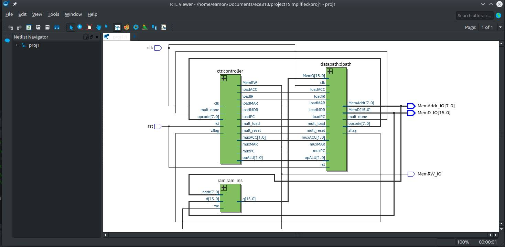

# Simple-Acc
A simple RISC computer expressed in Verilog and System Verilog.


## Description
This project implements a simple computer in Verilog and System Verilog.  Programs are loaded in through the testbench directly into RAM, and all instructions have the following format
16'h [operands][opcode]
with the following opcodes implemented:

0x01  ADD

0x02  OR

0x09 MULL

0x0A Neg

0x3 JUMP

0x4 JUMPZ

0x5 LOAD

0x6 STORE

Program results are stored to the accumulator.
For example, in the program
```@0000 0B05    // LOAD  11   acc = 0010
@0001 0C01    // ADD   12   acc = 0001 + 0010 = 0011
@0002 0A02    // OR   10   acc = 0011 | 0100 = 0111
@0003 0d06    // STORE 13   Store 0111 to 0x000d
@0004 0d09    // MULL 13 acc =  acc * 0x7 = 49 = 110001
@0005 0D0A    // NEG acc = NEG 49 => ignore address.
@0006 0603    // JUMPZ  6  => alu not zero so nothing happens.
@0007 0e06    // STORE 14
@0008 0804    // JMP 08 // this will halt the code.
@0009 0000
@000a 0004    //A data = 4
@000b 0002    //B data = 2
@000c 0001    //C data = 1
@000d 0000    //Store value
@000e 0000
```
0xFCE is the final result stored to the accumulator.  This program is also included in the memorylist.v file.

## Running Code
Compile proj1.v using your preferred tool and run the testbench.  This code was produced using ModelSim and Quartus, but theoretically, the testbench can be altered to use GTK Wave and Verilator; Iverilog might not be suitable for the scope of this project.

## Notes
This was a class project for ECE 310 Design of Complex Digital Systems, so there are a few quirks.
<ol>
<li>The multiplier unit is sequential and separate from the ALU.  There are very few situations I'm aware of that justify using a sequential instead of combinational multiplier, but this project required using a past homework assignment with the top level module my8bitmultiplier; this naming convention was also a requirement.</li>
<li>Explicitly setting the controller signals in each state makes for repetitive code.  Changing each control signal to a wire hooked up to some combinational unit taking in the current states makes the most sense as it forces the hardware to be combinational.  However, this unit ultimately synthesizes the same since inferred latches were avoided.</li>
<li>There is no hardware equivalent for loading a program through a testbench (maybe using a ROM flashed with the desired program), but some hardware interface for programming would make sense though beyond the scope of this project.</li>
</ol> 
